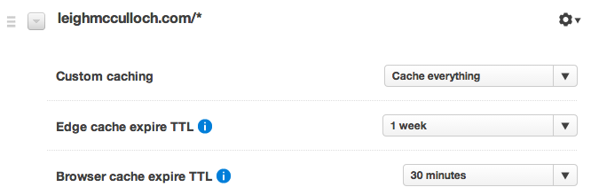

# Middleman CDN

[](https://gitter.im/leighmcculloch/middleman-cdn?utm_source=badge&utm_medium=badge&utm_campaign=pr-badge&utm_content=badge)
[](http://badge.fury.io/rb/middleman-cdn) [](https://travis-ci.org/leighmcculloch/middleman-cdn) [](https://coveralls.io/r/leighmcculloch/middleman-cdn)

A [middleman](http://middlemanapp.com/) deploy tool for invalidating resources cached
on common Content Delivery Networks (CDNs).

* Cache invalidation of files on:
  * [CloudFlare](https://cloudflare.com)
  * [MaxCDN](https://maxcdn.com)
  * [Fastly](https://fastly.com)
  * [Amazon CloudFront](https://aws.amazon.com/cloudfront/)
  * [Rackspace CloudFiles](http://www.rackspace.com/cloud/files/)
* Select files for invalidation with regex.  
* Automatically invalidate after build.
* Manually trigger invalidation with a single command on specific files.
* Invalidating files only when they've changed [if you're using middleman-s3_sync](#invalidating-with-middleman-s3_sync).

# Usage

## Installation

Add this to your `Gemfile`:  
```ruby
gem "middleman-cdn"
```

Then run:  
```
bundle install
```

## Configuration

Edit your middleman `config.rb` and add the following. Specify either one or
more CDN configurations.
```ruby
activate :cdn do |cdn|
  cdn.cloudflare = {
    client_api_key: '...',          # default ENV['CLOUDFLARE_CLIENT_API_KEY']
    email: 'you@example.com',       # default ENV['CLOUDFLARE_EMAIL']
    zone: 'example.com',
    base_urls: [
      'http://example.com',
      'https://example.com',
    ]
  }
  cdn.maxcdn = {
    alias: "...",                   # default ENV['MAXCDN_ALIAS']
    consumer_key: "...",            # default ENV['MAXCDN_CONSUMER_KEY']
    consumer_secret: "...",         # default ENV['MAXCDN_CONSUMER_SECRET']
    zone_id: "...",
  }
  cdn.fastly = {
    api_key: '...',                 # default ENV['FASTLY_API_KEY']
    base_urls: [
      'http://www.example.com',
      'https://www.example.com'
    ],
  }
  cdn.cloudfront = {
    access_key_id: '...',           # default ENV['AWS_ACCESS_KEY_ID']
    secret_access_key: '...',       # default ENV['AWS_SECRET_ACCESS_KEY']
    distribution_id: '...'
  }
  cdn.rackspace = {
    username: "...",                # default ENV['RACKSPACE_USERNAME']
    api_key: "...",                 # default ENV['RACKSPACE_API_KEY']
    region: "DFW",                  # DFW, SYD, IAD, ORD, HKG, etc
    container: "...",
    notification_email: "you@example.com" # optional
  }
  cdn.filter            = /\.html/i # default /.*/
  cdn.after_build       = true      # default is false
end
```

### Configuration: Filter

The `filter` parameter defines which files in your middleman `build` directory
will be invalidated on the CDN. It must be a regular expression (use
[rubular](http://rubular.com/) to test your regex).  

Examples:

| Files         | Regex         |
|:------------- |:------------- |
| HTML files    | `/\.html$/i`  |
| All files     | `/.*/`        |

It's better to always invalidate only the files you need. If you're using
[middleman's asset pipeline](http://middlemanapp.com/basics/asset-pipeline/) to
generate fingerprinted CSS, JS and images, then you should never need to
invalidate them.

Note: Directories containing `index.html` files are automatically included when
their respective `index.html` is included in the filter. Both the slashed and
non-slashed version of the directory are invalidated. e.g. The file
`/blog/index.html` will also invalidate `/blog/` and `/blog`.

Alternatively: If you're using `middleman-s3_sync` you can hook middleman-cdn into 
it's build process. See the [instructions here](#invalidating-with-middleman-s3_sync).

### Configuration: CloudFlare

The `cloudflare` parameter contains the information specific to your CloudFlare
account and which zone (domain) files should be invalidated for. CloudFlare
invalidation works off URLs not filenames, and you must provide a list of
base urls to ensure we invalidate every URL that your files might be accessed
at.

| Parameter | Description |
|:--------- |:----------- |
| `client_api_key` | You can find this by logging into CloudFlare, going to your account page and it will be down the bottom left. |
| `email` | The email address that you use to login to CloudFlare with. |
| `zone` | The domain name of the website we are invalidating. |
| `base_urls` | An array of base URLs that the files are accessible at. |

CloudFlare invalidations often take a few seconds.

### Configuration: MaxCDN

The `maxcdn` parameter contains the information specific to your MaxCDN
account. Your `alias` can be found on the API tab of your MaxCDN account page,
and you'll need to create an `application` in your MaxCDN account which
will provide you with API keys. The extension works by invalidating files
in pull zones. Make sure you add your website as a pull zone.

| Parameter | Description |
|:--------- |:----------- |
| `alias` | You can find this by logging into MaxCDN, going to your account page, and then going to the API tab and it will be down the bottom right. |
| `consumer_key` | You can find this by logging into MaxCDN, going to your account page, and then going to the API tab and creating an application which will give you a key and secret. |
| `secret_key` | You can find this by logging into MaxCDN, going to your account page, and then going to the API tab and creating an application which will give you a key and secret. |
| `zone_id` | Each pull zone has a zone_id, you'll find this in your account. |

MaxCDN invalidations often take a few seconds.

### Configuration: Fastly

The `fastly` parameter contains the information specific to your Fastly
account. Fastly invalidation works off URLs not filenames, and you must provide
a list of base urls to ensure we invalidate every URL that your files might be
at.

| Parameter | Description |
|:--------- |:----------- |
| `api_key` | You can find this by logging into Fastly, going to your account page and it will be on the left. |
| `base_urls` | An array of base URLs that the files are accessible at. |

Fastly invalidations often take a few seconds.

### Configuration: CloudFront

The `cloudfront` parameter contains the information specific to your AWS CloudFront
account and which distribution files should be invalidated for.

| Parameter | Description |
|:--------- |:----------- |
| `access_key_id` | AWS Access Key ID (generate in AWS Console IAM) |
| `secret_access_key` | AWS Secret Access Key (generate in AWS Console IAM) |
| `distribution_id` | The distribution ID on the CloudFront distribution. |

CloudFront invalidations take up to 15 minutes. You can monitor the progress of
the invalidation in your AWS Console.

### Configuration: Rackspace CloudFiles

The `rackspace` parameter contains the information specific to your Rackspace
account. The extension works by invalidating files stored at the edge on
Rackspace's CDN (Akaimi) that mirrors Rackspace's CloudFiles. If you specify a
notification email, you will receive an email from Akaimi when the invalidation
has been completed.

| Parameter | Description |
|:--------- |:----------- |
| `username` | Your Rackspace username. |
| `api_key` | Your Rackspace API key. |
| `region` | The region the CloudFiles container is stored in. Typically this is `DFW` unless you specified an alternative region for your container. Examples: `DFW`, `SYD`, `IAD`, `ORD`, `HKG`. |
| `container` | The CloudFiles container. |
| `notification_email` | An email will be sent to this address after the invalidation has completed. |

Note:
1. At the time of writing Rackspace allows 25 files to be invalidated per
day.
2. This extension will only invalidate files on the CDN and will not synchronise
or upload files to CloudFiles. Use [middleman-sync](https://github.com/karlfreeman/middleman-sync) to do that.

### Credentials via Environment Variables

Instead of storing your CDN credentials in config.rb where they may be public
on github, store them in environment variables, or execute on the
commandline as. Any parameters with a default of `ENV[...]` (see above) can be stored
as environment variables or provided on the commandline like this example.

```bash
CLOUDFLARE_CLIENT_API_KEY= CLOUDFLARE_EMAIL= bundle exec middleman invalidate
```

## Invalidating

Set `after_build` to `true` and the cache will be invalidated after build:  
```bash
bundle exec middleman build
```

Or, invalidate manually using:  
```bash
bundle exec middleman cdn
```

Or, invalidate specific files manually:
```bash
bundle exec middleman cdn [file] [file] ...
```

## Invalidating with middleman-s3_sync

If you're using `middleman-s3_sync` you can hook middleman-cdn into it's build process, to invalidate only the files that s3_sync uploads. Add the following to your `config.rb`:
```ruby
after_s3_sync do |files_by_status|
  cdn_invalidate(files_by_status[:updated])
end
```

Also, make sure to remove `cdn.after_build = true` from your config, if it was there previously, so the invalidation is not run twice.

## Example Usage

I'm using middleman-cdn on my personal website [leighmcculloch.com](http://leighmcculloch.com) which is on [github](https://github.com/leighmcculloch/leighmcculloch.com) if you want to checkout how I deploy. It's configuration has all of the above CDNs in use for demonstration. I primarily use CloudFlare, and unlike the other CDNs, CloudFlare doesn't default to caching HTML. To make the most of CloudFlare, configure a PageRule that looks like this to tell CloudFlare to cache everything.  


## Thanks

Middleman CDN is a fork off [Middleman CloudFront](https://github.com/andrusha/middleman-cloudfront) and I used it as the base for building this extension. The code was well structured and easy to understand. It was easy to break out the CloudFront specific logic and to add support for CloudFlare and the other CDNs. My gratitude goes to @andrusha and @manuelmeurer for their work on Middleman CloudFront.

Thanks to @manuelmeurer for helping port this gem for Middleman v4 and [numerous other valuable contributions](https://github.com/leighmcculloch/middleman-cdn/commits?author=manuelmeurer).

Thanks to @b4k3r for the [Cloudflare gem](https://github.com/b4k3r/cloudflare) that made invalidating CloudFlare files a breeze.

Thanks to @geemus and the many contributors to the [fog gem](https://github.com/fog/fog) that made invalidating CloudFront easy.

Official gems from [Fastly](https://github.com/fastly/fastly-ruby) and [MaxCDN](https://github.com/MaxCDN/ruby-maxcdn) are used for interacting with their services.

## Why Middleman CDN

It's becoming increasingly common for static websites to be hosted across multiple CDNs. [jsDelivr](http://jsdelivr.com/) is a well known promoter of this strategy and it's a strategy I want my toolset (middleman) to support for my next side project.

I've created this extension so that it can grow to support the CDNs we (you and me) are using.
